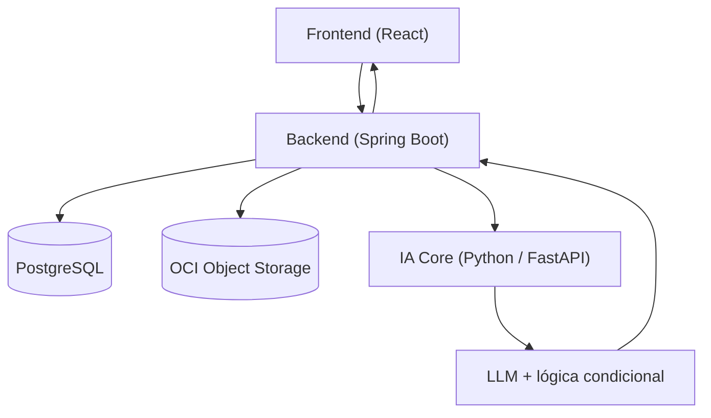
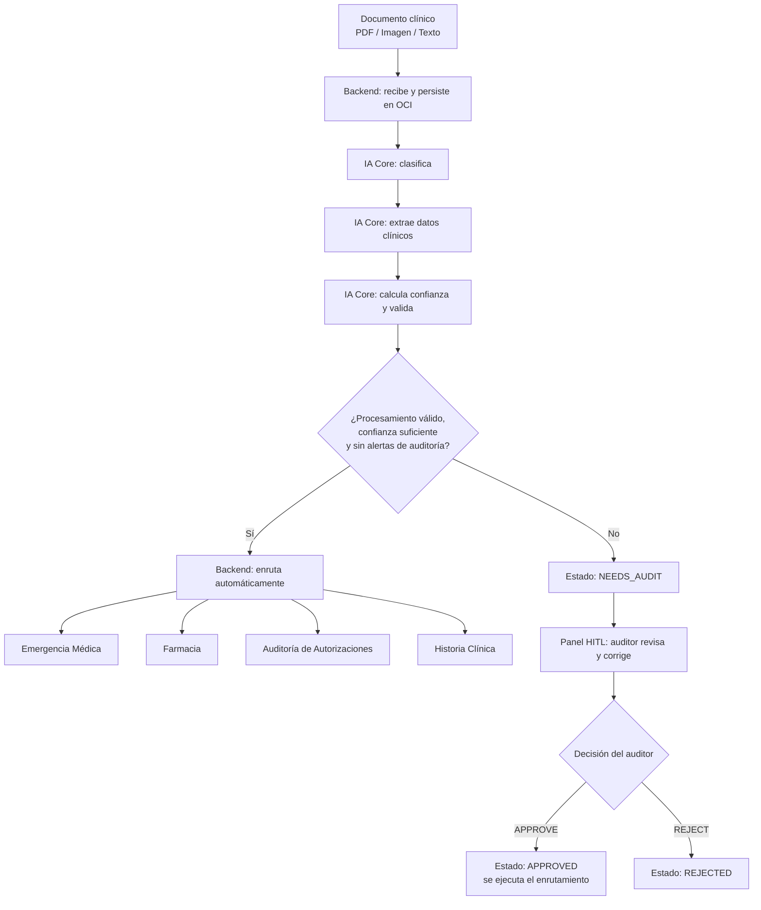

# MediFlow — Agente Autónomo para Triaje, Extracción y Enrutamiento de Documentos Clínicos

**Programa ONE · Grupo 10 — Oracle Next Education & Alura**

> Documentación técnica completa de arquitectura y contratos: [`docs/ARCHITECTURE.md`](./docs/ARCHITECTURE.md) — *v1.0, Baseline approved*.

---

## El problema

Hospitales, laboratorios y aseguradoras de salud pierden miles de horas con equipos administrativos leyendo manualmente informes y recetas para transcribir datos en sistemas heredados. Ese proceso manual es lento, costoso y está sujeto a errores graves de tipeo y demoras en la atención de pacientes con cuadros de urgencia.

**MediFlow** es un agente autónomo que recibe documentos clínicos y administrativos (PDF, imagen o texto), los clasifica, extrae sus datos esenciales con LLMs, evalúa consistencia y confianza, y los enruta automáticamente al destino correcto — con revisión humana (Human-in-the-Loop) para los casos ambiguos o de baja confianza.

## Objetivo del MVP

1. **Ingerir** documentos clínicos en PDF, imagen o texto/JSON.
2. **Clasificar** automáticamente el tipo de documento (receta, informe de imágenes, informe de estudio, orden de procedimiento, epicrisis, certificado médico).
3. **Extraer** datos clínicos y administrativos esenciales (paciente, profesional/matrícula, diagnóstico/CIE-10, medicamentos, dosis, urgencia).
4. **Evaluar** consistencia, conflictos y confianza de la extracción.
5. **Enrutar** el resultado hacia el destino correspondiente (Emergencia Médica, Farmacia, Auditoría de Autorizaciones, Historia Clínica, o Revisión Humana en caso de ambigüedad).

## Arquitectura resumida



- **Frontend** envía el documento (archivo o texto) al Backend y consume el resultado o el panel de auditoría.
- **Backend** persiste en OCI y PostgreSQL, normaliza la entrada, llama al servicio de IA, valida su respuesta y arma la respuesta final.
- **IA Core** clasifica, extrae, calcula confianza, valida y sugiere el destino de enrutamiento.
- El procesamiento es **síncrono** para el MVP: sin colas, con timeout de 30 segundos por intento y como máximo 1 retry ante fallos transitorios de IA (hasta 60 segundos de espera de IA, más persistencia y transporte).

El enrutamiento del MVP es **lógico/simulado**: persiste el destino, lo expone en el resultado JSON y en el Frontend, y refleja el estado en OCI; no integra sistemas hospitalarios externos. PostgreSQL conserva el resultado actual y un historial de resultados/decisiones disponible en `GET /api/v1/documents/{id}/history`. OCI conserva el original y un artefacto JSON del resultado y la decisión actuales.

El detalle completo de contratos entre componentes, estados, `audit_reasons`, modelo de datos y manejo de errores está en [`docs/ARCHITECTURE.md`](./docs/ARCHITECTURE.md).

Estructura común de extracted_data: las claves son opcionales; un valor desconocido se omite o se envía en null. patient admite name (string) y age (entero no negativo); requesting_doctor admite name y license_number (strings); primary_diagnosis y suggested_icd10 son strings; medications es un array de objetos con name y dosage (strings opcionales/nullable). [] indica que no se identificaron medicamentos. requested_studies es un array de objetos con name (string opcional/nullable), correspondiente a los estudios solicitados en el documento. [] indica que no se identificaron estudios solicitados; no se infieren estudios que no consten explícitamente en el documento. Se permiten campos adicionales JSON por tipo de documento, sin exigir formularios exhaustivos en el Frontend.

## Diagrama del flujo del agente



## Tecnologías

| Componente | Stack |
|---|---|
| Frontend | React, TypeScript, Vite, Material UI, React Router |
| Backend & Cloud | Java, Spring Boot, PostgreSQL, Docker, OCI SDK |
| IA & Lógica Core | Python, FastAPI, Pydantic, LangGraph (o pipeline Python puro) |
| LLM | Google Gemini API |
| Persistencia de archivos | OCI Object Storage (capa Always Free) |

## Documentación por squad

La documentación del proyecto se organiza por ámbito de responsabilidad:

- **Arquitectura y contratos compartidos:** [`docs/architecture/`](./docs/architecture/)
- **Frontend & UX:** [`docs/frontend-ux/`](./docs/frontend-ux/)
- **Backend & Cloud:** [`docs/backend-cloud/`](./docs/backend-cloud/)
- **IA Core:** [`docs/ia-core/`](./docs/ia-core/)
- **Producto & QA:** [`docs/producto-qa/`](./docs/producto-qa/)

La referencia canónica de arquitectura y contratos compartidos continúa siendo [`docs/ARCHITECTURE.md`](./docs/ARCHITECTURE.md).

---
## Cómo ejecutar

> ⚠️ Esta sección se completará con los comandos definitivos a medida que los servicios queden implementados y contenerizados. Los siguientes son de referencia provisional — nombres de carpetas y profiles de Spring Boot pueden cambiar.

```bash
# Clonar el repositorio
git clone https://github.com/No-Country-simulation/G10-MediFlow-Team11.git
cd G10-MediFlow-Team11

# Backend (Spring Boot)
cd backend
./mvnw spring-boot:run

# IA Core (Python)
cd ../ia-core
pip install -r requirements.txt
uvicorn main:app --reload

# Frontend (React + Vite)
cd ../frontend
npm install
npm run dev
```

### Variables de entorno previstas

> Los nombres definitivos se documentarán cuando los servicios queden configurados.

```env
OCI_BUCKET_NAME=mediflow-documentos-clinicos
OCI_NAMESPACE=<namespace>
DATABASE_URL=<postgresql-url>
AI_SERVICE_URL=<url-del-servicio-python>
AUDIT_CONFIDENCE_THRESHOLD=0.85
GEMINI_API_KEY=<api-key>
GEMINI_MODEL=<model-id>
```

## Los 3 escenarios obligatorios de demostración

| # | Escenario | Resultado esperado |
|---|---|---|
| 1 | Flujo estándar procesado automáticamente | `status = PROCESSED`, ruteo automático sin auditoría |
| 2 | Caso con prioridad de urgencia médica | `nivel_prioridad = URGENTE`, `destino_principal = EMERGENCIA_MEDICA`, notificación generada |
| 3 | Caso ambiguo / erróneo → revisión humana | `status = NEEDS_AUDIT` con al menos un `audit_reason` (ej. `LOW_CONFIDENCE`, `ILLEGIBLE_DOCUMENT`), corregido vía panel HITL |

## OCI Object Storage

Bucket único `mediflow-documentos-clinicos` (capa Always Free), organizado por prefijos lógicos:

```
recibidos/              (archivos y textos crudos apenas llegan)
procesados/urgentes/    (urgentes procesados correctamente o aprobados por humano)
procesados/rutina/      (rutina procesados correctamente o aprobados por humano)
auditoria_humana/       (pendientes de revisión humana o rechazados)
```

---

Para contratos de API, modelo de datos, máquina de estados, `audit_reasons`, manejo de errores y responsabilidades por squad, ver la documentación técnica completa: [`docs/ARCHITECTURE.md`](./docs/ARCHITECTURE.md).
