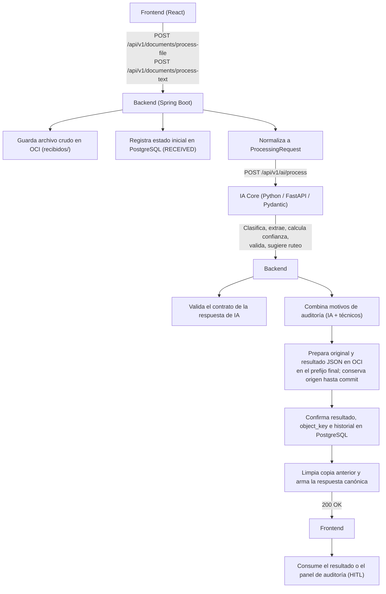
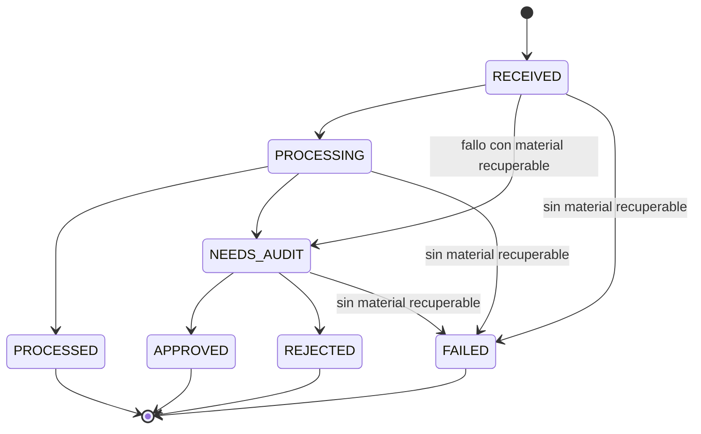
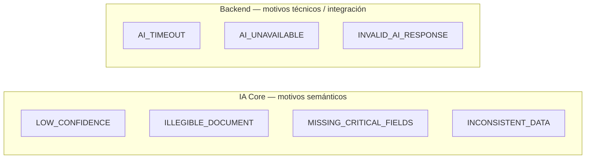
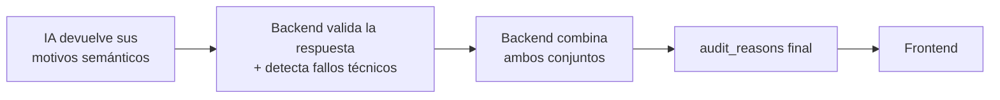
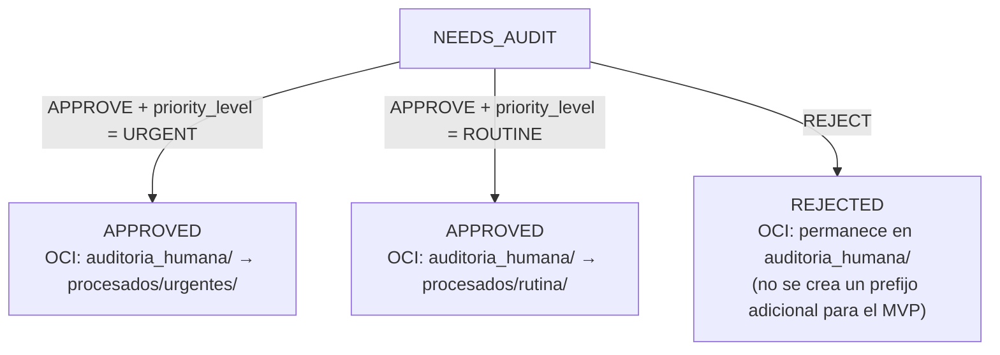
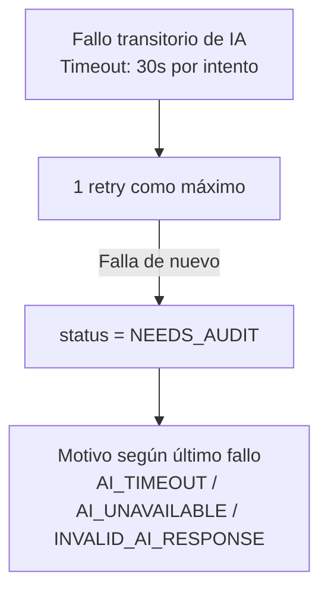

# MediFlow — Arquitectura Base y Contratos de Integración v1.0

> **Estado:** Baseline approved\
> **Hackathon:** ONE Grupo 10 — Oracle Next Education & Alura
>
> Cualquier modificación posterior que afecte interfaces entre componentes
> deberá comunicarse y acordarse con los squads involucrados.

---

## 1. Arquitectura General y Flujo de Datos



El procesamiento es **síncrono para el MVP**: no hay cola real ni `202 Accepted`. El Backend espera la respuesta de IA (con timeout) y devuelve el resultado completo en la misma llamada.

El diagrama muestra la ruta de éxito; el orden de persistencia y las compensaciones ante fallos se definen en la sección 12.

---

## 2. Ownership por Servicio

| Responsabilidad | Servicio |
|---|---|
| Clasificación, extracción, confianza, validación semántica y ruteo sugerido iniciales | **IA Core** |
| Confirmación/corrección clínica en HITL; aplicación de merge, validación estructural y persistencia de la revisión | **Auditor humano / Backend**, respectivamente |
| Resolución y garantía de unicidad de `document_id`, `status`, persistencia, OCI, timestamps, errores técnicos, respuesta final al Frontend | **Backend** |
| Redacción de la notificación final (plantilla) | **Backend** |
| Validación de que la respuesta de IA cumple el contrato acordado | **Backend** |
| Valor final de `requires_human_review` | **Backend** |

IA Core **no** devuelve `status` del documento, ni datos de almacenamiento OCI, ni el texto final de la notificación. Esos campos son responsabilidad exclusiva del Backend.

**`requires_human_review` es autoridad final del Backend**, no de IA. Se deriva del `status`, no de la presencia histórica de motivos:

```
status = NEEDS_AUDIT  → requires_human_review = true
cualquier otro status → requires_human_review = false
```

`audit_reasons` conserva los motivos que originaron la revisión incluso después de `APPROVED` o `REJECTED`, por trazabilidad. `requires_human_review` representa si el documento requiere revisión **actualmente**. Si la regla se basara en `audit_reasons` en vez de en `status`, un documento ya `APPROVED` con motivos históricos (p. ej. `["LOW_CONFIDENCE"]`) volvería a marcar `requires_human_review = true`, lo cual es incorrecto.

---

## 3. Endpoints Externos: `process-file` y `process-text`

El reto exige ingerir documentos en PDF, imagen o texto/JSON. Se exponen dos endpoints explícitos en vez de un único endpoint multiformato:

### `POST /api/v1/documents/process-file`

```
Content-Type: multipart/form-data

document_id: String (opcional)
file: (PDF, JPG, PNG)
origin_channel: String
```

### `POST /api/v1/documents/process-text`

```json
{
  "document_id": "DOC-CLIN-2026-8942",
  "document_text": "HOSPITAL SANTA LUCIA - INFORME DE ESTUDIO RADIOLOGICO...",
  "origin_channel": "Guardia_Emergencias"
}
```

En ambos, `document_id` es **opcional**:

```
Si viene document_id → Backend lo valida y lo utiliza.
Si no viene           → Backend genera uno.
```

Ambos endpoints devuelven la misma **respuesta canónica** (sección 6) y, en el Backend, convergen en el mismo pipeline interno de procesamiento.

---

## 4. Normalización Interna: `ProcessingRequest`

Internamente, el Backend traduce cualquiera de las dos entradas a un único DTO antes de llamar a IA. IA Core solo conoce esta forma normalizada, nunca los dos formatos externos por separado.

```json
{
  "document_id": "DOC-CLIN-2026-8942",
  "input_type": "FILE",
  "mime_type": "application/pdf",
  "file_name": "informe.pdf",
  "content_base64": "...",
  "document_text": null,
  "origin_channel": "Guardia_Emergencias"
}
```

```json
{
  "document_id": "DOC-CLIN-2026-8943",
  "input_type": "TEXT",
  "mime_type": "text/plain",
  "file_name": null,
  "content_base64": null,
  "document_text": "HOSPITAL SANTA LUCIA...",
  "origin_channel": "Guardia_Emergencias"
}
```

Reglas de validación:

```
input_type = FILE → content_base64 obligatorio
input_type = TEXT → document_text obligatorio
```

Para el volumen de un hackathon (PDFs/imágenes sintéticas), enviar el archivo en Base64 dentro del JSON es una simplificación razonable. En producción se evaluaría evitar el overhead de Base64.

---

## 5. Contrato Único Backend → IA: `POST /api/v1/ai/process`

Un solo endpoint, un solo DTO, un solo mock para el Squad IA.

**Request:** el `ProcessingRequest` de la sección 4.

**Response (200 OK):**

```json
{
  "document_id": "DOC-CLIN-2026-8942",

  "classification": {
    "document_type": "IMAGING_REPORT",
    "specialty": "Radiologia / Neumonologia",
    "priority_level": "URGENT"
  },

  "confidence": {
    "classification": 0.99,
    "extraction": 0.94,
    "global": 0.96
  },

  "extracted_data": {
    "patient": { "name": "Carlos Eduardo Mendes", "age": 52 },
    "requesting_doctor": { "name": "Dra. Renata Silveira", "license_number": "145892" },
    "primary_diagnosis": "Tromboembolismo Pulmonar Agudo",
    "suggested_icd10": "I26.9"
  },

  "validation": {
    "missing_fields": [],
    "inconsistencies": [],
    "warnings": []
  },

  "routing_decision": {
    "primary_destination": "MEDICAL_EMERGENCY",
    "audit_reasons": [],
    "justification": "Hallazgo de alta prioridad clínica."
  }
}
```

**`requires_human_review` no forma parte de este contrato.** IA solo reporta `audit_reasons` semánticos; el booleano final lo calcula exclusivamente el Backend a partir del `status` del documento (sección 2). Mantener el booleano en ambos lados crearía dos versiones del mismo campo (`IA.requires_human_review` vs `Backend.requires_human_review`) sin necesidad.

### Campos mínimos de la respuesta de éxito de IA

HTTP `200` solo se devuelve si se cumple este contrato. Todas las claves de primer nivel del ejemplo son obligatorias. No se permiten motivos técnicos en `routing_decision.audit_reasons`.

| Bloque/campo | Tipo y obligatoriedad |
|---|---|
| `document_id` | String no vacío, idéntico al recibido |
| `classification` | Objeto obligatorio; `document_type` y `priority_level` son enums obligatorios, `specialty` es string o null |
| `confidence` | Objeto obligatorio con `classification`, `extraction` y `global`: números entre 0 y 1 |
| `extracted_data` | Objeto obligatorio con la estructura común indicada abajo; puede contener valores desconocidos |
| `validation` | Objeto obligatorio; `missing_fields`, `inconsistencies` y `warnings` son arrays de strings, vacíos cuando no hay hallazgos |
| `routing_decision` | Objeto obligatorio con `primary_destination` del enum, `audit_reasons` como array de motivos semánticos y `justification` como string no vacío |

Estructura común de `extracted_data`: las claves son opcionales; un valor desconocido se omite o se envía en null. `patient` admite `name` (string) y `age` (entero no negativo); `requesting_doctor` admite `name` y `license_number` (strings); `primary_diagnosis` y `suggested_icd10` son strings; `medications` es un array de objetos con `name` y `dosage` (strings opcionales/nullable). `[]` indica que no se identificaron medicamentos. `requested_studies` es un array de objetos con `name` (string opcional/nullable), correspondiente a los estudios solicitados en el documento. `[]` indica que no se identificaron estudios solicitados; no se infieren estudios que no consten explícitamente en el documento. Se permiten campos adicionales JSON por tipo de documento, sin exigir formularios exhaustivos en el Frontend. Un objeto `{}` es estructuralmente válido; las carencias clínicas se señalan en `validation` y, si son críticas, con `MISSING_CRITICAL_FIELDS`.

Ninguno de los bloques completos puede ser null en un éxito de IA. Si no es posible clasificar con alguno de los tipos admitidos o producir esta estructura, IA usa el error controlado siguiente. Los null de la respuesta canónica los construye el Backend ante fallos o después de revisión humana (secciones 6 y 9).

### Error controlado de IA

Si el LLM no produce una respuesta estructurada válida, IA Core devuelve **HTTP `502`**, nunca un `200` con `INVALID_AI_RESPONSE` dentro del resultado:

```json
{
  "error": {
    "code": "AI_OUTPUT_INVALID",
    "message": "No se pudo producir una respuesta estructurada válida."
  }
}
```

Los errores controlados de IA usan este sobre `{ error: { code, message } }`; una solicitud inválida devuelve `400 INVALID_REQUEST`. El Backend traduce `502 AI_OUTPUT_INVALID` a `INVALID_AI_RESPONSE` si los intentos permitidos no obtienen éxito (sección 12). Esta regla sustituye el comportamiento de una iteración de borrador anterior que permitía reportar ese motivo desde IA en un HTTP 200.

Enums acordados (sin texto libre):

```
document_type: PRESCRIPTION | IMAGING_REPORT | STUDY_REPORT |
                PROCEDURE_ORDER | DISCHARGE_SUMMARY | MEDICAL_CERTIFICATE
priority_level: ROUTINE | URGENT
primary_destination: MEDICAL_EMERGENCY | PHARMACY | AUTHORIZATION_AUDIT |
                   MEDICAL_RECORD | HUMAN_REVIEW
```

`IMAGING_REPORT` cubre los informes de imágenes; `STUDY_REPORT` cubre los demás informes de estudio del MVP. No se incorporan categorías clínicas adicionales.

`primary_destination` en la respuesta de IA representa el **destino de negocio sugerido**. Si el Backend determina `status = NEEDS_AUDIT`, ese destino no se ejecuta todavía: el documento permanece en `auditoria_humana/` hasta que un auditor lo apruebe o corrija. Cuando IA no produce un destino confiable (por ejemplo, `AI_TIMEOUT`), el Backend usa `HUMAN_REVIEW` en la respuesta canónica.

**Ejecutar enrutamiento en el MVP significa una acción lógica/simulada:** persistir el destino confirmado, incluirlo en el resultado JSON, exponerlo por API/Frontend y reflejar el estado/prioridad en el prefijo OCI y el destino en su artefacto JSON. No se llama a sistemas externos de Emergencias, Farmacia, Autorizaciones o Historia Clínica. Con una respuesta válida sin motivos de auditoría y destino distinto de `HUMAN_REVIEW`, el resultado es `PROCESSED`; con motivos semánticos o destino `HUMAN_REVIEW`, es `NEEDS_AUDIT`. Los fallos técnicos siguen la sección 12.

---

## 6. Respuesta Canónica Backend → Frontend

Es la que consume el Frontend al pedir el resultado de un documento:

```json
{
  "document_id": "DOC-CLIN-2026-8942",
  "status": "PROCESSED",

  "classification": {
    "document_type": "IMAGING_REPORT",
    "specialty": "Radiologia / Neumonologia",
    "priority_level": "URGENT"
  },

  "confidence": {
    "classification": 0.99,
    "extraction": 0.94,
    "global": 0.96
  },

  "extracted_data": { "...": "..." },

  "validation": {
    "missing_fields": [],
    "inconsistencies": [],
    "warnings": []
  },

  "routing_decision": {
    "primary_destination": "MEDICAL_EMERGENCY",
    "requires_human_review": false,
    "audit_reasons": [],
    "justification": "..."
  },

  "notification": {
    "generated": true,
    "type": "MEDICAL_EMERGENCY",
    "message": "ALERTA URGENTE: el documento DOC-CLIN-2026-8942 requiere atención inmediata."
  },

  "storage": {
    "provider": "OCI_OBJECT_STORAGE",
    "state": "SUCCESS"
  }
}
```

El Frontend **no** recibe bucket, namespace ni object key internos — eso es infraestructura y queda encapsulado en el Backend. Para casos de rutina sin alerta, el Backend devuelve `"notification": { "generated": false }`.

### Respuesta cuando IA no responde o falla

Los bloques derivados de IA (`classification`, `confidence`, `extracted_data`, `validation`) son **nullable**: se devuelven en `null` cuando no existe una respuesta válida del servicio de IA. `routing_decision`, `storage` y `status` siempre están presentes porque los arma el Backend.

Tras una revisión, los bloques completados por el humano pueden tener valores aunque IA haya fallado. `confidence` permanece null si no hubo respuesta válida de IA o si se modificó su contenido clínico/clasificación/destino (sección 9). Para estados iniciales `RECEIVED`/`PROCESSING`, los bloques aún no obtenidos son null; se persisten destino `HUMAN_REVIEW`, justificación `Procesamiento pendiente`, `audit_reasons = []` y `notification = { "generated": false }`. `storage.state` usa `PENDING`, `SUCCESS` o `ERROR` según la sección 10, sin alterar el enum de `status`.

```json
{
  "document_id": "DOC-CLIN-2026-8942",
  "status": "NEEDS_AUDIT",

  "classification": null,
  "confidence": null,
  "extracted_data": null,
  "validation": null,

  "routing_decision": {
    "primary_destination": "HUMAN_REVIEW",
    "requires_human_review": true,
    "audit_reasons": ["AI_TIMEOUT"],
    "justification": "El servicio de IA no respondió dentro del tiempo configurado."
  },

  "notification": { "generated": false },

  "storage": {
    "provider": "OCI_OBJECT_STORAGE",
    "state": "SUCCESS"
  }
}
```

---

## 7. Estados (Máquina de Estados)

`status` representa dónde está el documento en el workflow. Es un enum único y compartido por todos los squads (sin variantes como `processed`, `Procesado`, `DONE`, `completed`).



`REJECTED` corresponde a `decision = REJECT` en el endpoint de revisión (sección 9). Para el MVP no se define un flujo posterior de reprocesamiento: `REJECTED` es un estado terminal fuera de la lista activa de auditoría.

Regla para decidir entre `NEEDS_AUDIT` y `FAILED`:

```
¿Existe material suficiente para revisión humana?
Sí → NEEDS_AUDIT
No → FAILED
```

Ejemplos de `NEEDS_AUDIT`: timeout de IA, IA no disponible, respuesta inválida, documento ilegible, baja confianza — en todos estos casos el archivo ya está en OCI y puede revisarse.

Ejemplos de `FAILED`: no se pudo conservar ningún original recuperable, o el archivo está corrupto y no puede abrirse. Un fallo de persistencia por sí solo no implica `FAILED`: con material recuperable corresponde `NEEDS_AUDIT`, sujeto a poder registrar el resultado en PostgreSQL (sección 12). Si ni siquiera existe un registro durable, se devuelve el error HTTP sin afirmar que se persistió un estado.

---

## 8. `audit_reasons`: Enum y Ownership

`audit_reasons` es un array (un documento puede fallar por varias razones a la vez) y es distinto de `status`: `status` dice *dónde está* el documento, `audit_reasons` dice *por qué* llegó ahí.

```json
{
  "status": "NEEDS_AUDIT",
  "audit_reasons": ["LOW_CONFIDENCE", "MISSING_CRITICAL_FIELDS"]
}
```

Enum completo:

```
LOW_CONFIDENCE
ILLEGIBLE_DOCUMENT
MISSING_CRITICAL_FIELDS
INCONSISTENT_DATA
INVALID_AI_RESPONSE
AI_TIMEOUT
AI_UNAVAILABLE
```

**Regla de ownership (importante):** no todos los motivos pueden originarse en IA Core, porque algunos describen justamente el caso en que IA no respondió o violó el contrato HTTP esperado.



`INVALID_AI_RESPONSE` es responsabilidad del Backend: se asigna ante JSON malformado, un HTTP 200 que viola el esquema o una respuesta de IA inutilizable, incluido el error controlado de la sección 5 después de aplicar la política de retry. IA solo devuelve los cuatro motivos semánticos en una respuesta de éxito; nunca devuelve `INVALID_AI_RESPONSE` dentro de ese payload.

**Regla arquitectónica final:** el servicio de IA reporta los motivos derivados del análisis del documento. El Backend es responsable de construir el conjunto final de `audit_reasons`, incorporando los motivos reportados por IA y cualquier condición técnica detectada durante la integración.



Este enum diferenciado permite que el Squad Producto diseñe cada documento de prueba sabiendo exactamente qué condición debe disparar, y hace más clara la demo obligatoria de los 3 escenarios (rutina, urgencia, ambigüedad/error → revisión humana).

**Threshold de confianza:**

```
AUDIT_CONFIDENCE_THRESHOLD = 0.85   (configurable; 0.85 es solo el valor inicial del MVP)

confidence.global < AUDIT_CONFIDENCE_THRESHOLD → LOW_CONFIDENCE
```

No se deja hardcodeado en el código de IA Core: vive como configuración externa (variable de entorno o archivo de config).

---

## 9. Human-in-the-Loop (HITL) Completo

### `GET /api/v1/documents/audit`
Lista documentos con `status = NEEDS_AUDIT`, con metadatos y referencia al documento original (PDF, imagen o texto) para que el auditor lo revise.

**Response (200 OK):** array, vacío si no hay pendientes, ordenado por `created_at` y luego `document_id`. Cada elemento tiene las siguientes claves obligatorias; `file_name` y `document_type` pueden ser null:

```json
[
  {
    "document_id": "DOC-CLIN-2026-8942",
    "status": "NEEDS_AUDIT",
    "input_type": "FILE",
    "mime_type": "application/pdf",
    "file_name": "informe.pdf",
    "document_type": null,
    "audit_reasons": ["AI_TIMEOUT"],
    "created_at": "2026-09-15T18:00:00Z",
    "updated_at": "2026-09-15T18:01:00Z"
  }
]
```

`document_id` es la referencia para abrir `GET /api/v1/documents/{id}` y `GET /api/v1/documents/{id}/content`; no se incluyen rutas internas OCI.

### `GET /api/v1/documents/{id}`
Devuelve el detalle completo de un documento (respuesta canónica de la sección 6).

### `GET /api/v1/documents/{id}/history`

Devuelve HTTP `200` con `{ "document_id": "...", "entries": [...] }`. Cada entrada contiene `sequence` (entero creciente por documento), `event_type` (`INITIAL_TRIAGE` o `HUMAN_REVIEW`), `decision` (null, `APPROVE` o `REJECT`), `occurred_at` (timestamp UTC ISO 8601) y `result` (snapshot completo de la respuesta canónica de la sección 6). `entries` se ordena por `sequence` ascendente, que refleja el orden de confirmación; queda vacío si aún no hay resultado. Un ID inexistente devuelve `404 DOCUMENT_NOT_FOUND`.

Se registra un resultado inicial automatizado, incluido el fallback técnico, y una entrada por decisión humana confirmada. La entrada humana contiene el resultado ya corregido, por lo que no se duplica con un evento adicional de corrección. No se registran transiciones internas como `RECEIVED → PROCESSING`. La persistencia append-only se define en la sección 10.

### `GET /api/v1/documents/{id}/content`

Devuelve el contenido del documento original (el PDF/imagen, o el texto si `input_type = TEXT`) para que el Frontend lo muestre en el panel de auditoría o en la vista de detalle. El Backend lee el objeto desde OCI usando `bucket`/`object_key` (sección 10) y lo entrega directamente — el Frontend nunca recibe esas credenciales ni rutas internas, coherente con la sección 6.

```
FILE → binario original; Content-Type = mime_type persistido (application/pdf, image/jpeg o image/png).
TEXT → JSON UTF-8 original almacenado; Content-Type = application/json.
```

Para TEXT se devuelve exactamente el objeto guardado en OCI con `document_id` resuelto, `document_text` y `origin_channel`; el Frontend muestra su campo `document_text`. PostgreSQL es la fuente durable de `input_type`, `mime_type` y `file_name`. En TEXT el `mime_type` persistido es `application/json`, porque describe el objeto almacenado; el `mime_type = text/plain` del `ProcessingRequest` describe el texto enviado a IA y no se copia a esa columna. `file_name` es null para TEXT.

### `PATCH /api/v1/documents/{id}/review`

Permite tanto **corregir** lo que IA ya produjo como **completar manualmente** un documento cuando IA no respondió (`classification`, `extracted_data`, etc. en `null`). Los campos de contenido admiten correcciones parciales: solo se envían los necesarios, sujetos a las invariantes de APPROVE y a la confirmación de `validation` detalladas abajo.

**Request:**
```json
{
  "classification": {
    "document_type": "IMAGING_REPORT",
    "specialty": "Radiologia",
    "priority_level": "URGENT"
  },
  "extracted_data": { "...": "..." },
  "routing_decision": {
    "primary_destination": "MEDICAL_EMERGENCY"
  },
  "validation": {
    "missing_fields": [],
    "inconsistencies": [],
    "warnings": []
  },
  "decision": "APPROVE"
}
```
Valores válidos de `decision`: `APPROVE` | `REJECT`.

`decision` es obligatorio. El Backend hace merge recursivo de los objetos enviados sobre el contenido persistido: las claves omitidas se conservan, los arrays se reemplazan completos y un null explícito borra únicamente un valor nullable. Se rechazan campos fuera del contrato de revisión; el auditor no modifica `status`, confianza ni `audit_reasons` directamente.

**Invariantes de APPROVE:** después del merge deben existir `classification.document_type` y `classification.priority_level` válidos, `extracted_data` no null con la forma común de la sección 5 y `routing_decision.primary_destination` válido y distinto de `HUMAN_REVIEW`. Si falla una condición, se devuelve `400 REVIEW_VALIDATION_FAILED` sin guardar correcciones, cambiar estado, enrutar ni escribir una decisión. `{}` puede satisfacer la forma de extracción: la confirmación de suficiencia clínica corresponde al auditor. `REJECT` no exige esos campos y no ejecuta enrutamiento.

**Control atómico de estado:** la revisión solo es válida desde `NEEDS_AUDIT`. En una transacción PostgreSQL el Backend bloquea la fila (`SELECT ... FOR UPDATE`), comprueba el estado y mantiene el bloqueo hasta confirmar o revertir la revisión, siguiendo la secuencia OCI de la sección 12. Cualquier otro estado, incluidos `RECEIVED` y `PROCESSING`, devuelve `409 INVALID_REVIEW_STATE` antes de cambios o escrituras OCI. Una solicitud repetida o atrasada no sobrescribe resultados ni duplica movimiento, enrutamiento o historial. Una revisión competidora espera el bloqueo y vuelve a comprobar el estado.

### Campos derivados después de revisión humana

- Los `audit_reasons` históricos se conservan. Si cambia efectivamente clasificación (incluida prioridad), datos extraídos o destino, las tres columnas de confianza quedan null y la respuesta actual devuelve `confidence: null`. La confianza anterior sigue disponible en el snapshot inicial del historial; no se agrega otro modelo de auditoría.
- `validation` representa la revisión final: el request admite opcionalmente ese objeto completo con los tres arrays de strings de la sección 5, confirmados por el auditor. Es obligatorio enviarlo si cambia alguno de esos contenidos o la validación previa es null; de lo contrario, la decisión confirma la validación existente. Su ausencia cuando es obligatorio devuelve `400 REVIEW_VALIDATION_FAILED`. Para `REJECT` sin correcciones puede seguir en null. El Backend valida la estructura; no inventa una nueva evaluación clínica ni vuelve a llamar a IA.
- La justificación final la construye el Backend: `Destino {primary_destination} confirmado por revisión humana` para APPROVE, y `Documento rechazado en revisión humana; no se ejecuta enrutamiento` para REJECT. No se conserva como justificación actual una explicación de IA para un destino anterior.
- Se regenera y persiste `notification` desde el resultado final: en APPROVE con prioridad `URGENT` y destino `MEDICAL_EMERGENCY`, se usa la plantilla `MEDICAL_EMERGENCY` de la sección 6; en los demás casos de revisión, incluido REJECT, se guarda `{ "generated": false }`. Generar significa producir el mensaje del resultado, no enviar comunicaciones externas.

**Response:**
```json
{
  "document_id": "DOC-CLIN-2026-8942",
  "status": "APPROVED",
  "message": "Revisión humana registrada correctamente"
}
```

Esto cubre los dos casos reales de HITL:

```
IA respondió pero necesita correcciones → el auditor corrige solo lo necesario
IA no respondió (AI_TIMEOUT / AI_UNAVAILABLE) → el auditor completa manualmente clasificación,
                                                  datos extraídos y destino de enrutamiento
```

Sin esto, un documento con `AI_TIMEOUT` podría terminar en `APPROVED` con `classification = null` y `routing_destination = null`, lo cual rompe el flujo aguas abajo.

**Mientras `status = NEEDS_AUDIT`, el Backend no ejecuta el destino de negocio sugerido:** el documento permanece en `auditoria_humana/`. El enrutamiento final se materializa únicamente después de `APPROVE`, usando los valores confirmados o corregidos por el auditor.

Tras la decisión, el Backend actualiza:



Las invariantes de APPROVE garantizan que existe una prioridad antes de aprobar, incluso cuando IA no respondió, y el Backend puede determinar el prefijo de destino correcto. El cambio de estado, el resultado final y la entrada de historial se confirman juntos; la respuesta de éxito solo se emite tras la persistencia de la sección 12.

---

## 10. Modelo Mínimo de Datos (PostgreSQL)

Tabla `documents`, con campos consultables promovidos fuera del JSONB:

**Identificación y auditoría**

| Campo | Regla / estructura | Descripción |
|---|---|---|
| `id` | — | — |
| `status` | Enum, sección 7 | — |
| `audit_reasons` | Array de enum, sección 8 | — |
| `origin_channel` | — | — |

**Entrada original**

| Campo | Regla / estructura | Descripción |
|---|---|---|
| `input_type` | `FILE` \| `TEXT`, obligatorio | — |
| `mime_type` | Obligatorio | Tipo del objeto original almacenado |
| `file_name` | — | Nombre original para `FILE`; `null` para `TEXT` |

**Almacenamiento OCI**

| Campo | Regla / estructura | Descripción |
|---|---|---|
| `bucket` | — | — |
| `object_key` | — | — |
| `storage_state` | `PENDING` \| `SUCCESS` \| `ERROR` | Estado de persistencia OCI del resultado actual |

**Clasificación y confianza**

| Campo | Regla / estructura | Descripción |
|---|---|---|
| `document_type` | Nullable | `AI_TIMEOUT`/`AI_UNAVAILABLE` puede crear el registro sin estos datos |
| `specialty` | Nullable | — |
| `priority` | Nullable | — |
| `confidence_classification` | Nullable | — |
| `confidence_extraction` | Nullable | — |
| `confidence_global` | Nullable | — |

**Enrutamiento**

| Campo | Regla / estructura | Descripción |
|---|---|---|
| `routing_destination` | Obligatorio | `HUMAN_REVIEW` al inicializar o sin destino confiable |
| `routing_justification` | Obligatoria | Persistida también en fallback |

**Bloques JSONB**

| Campo | Regla / estructura | Descripción |
|---|---|---|
| `extracted_data` | `JSONB, nullable` | Varía según tipo de documento |
| `validation` | `JSONB, nullable` | `{ missing_fields, inconsistencies, warnings }` |
| `notification` | `JSONB, obligatorio` | `{ generated: false }` cuando no hay notificación |

**Timestamps**

| Campo | Regla / estructura | Descripción |
|---|---|---|
| `created_at` | — | — |
| `updated_at` | — | — |

`extracted_data`, `validation` y `notification` permanecen como JSONB por su variabilidad según tipo de documento; el resto de los campos usados para filtrar o listar se mantiene como columnas explícitas.

**Las columnas y estos tres campos JSONB permiten que `GET /api/v1/documents/{id}` reconstruya la respuesta canónica completa (sección 6) sin recalcular el análisis.** La respuesta canónica incluye `specialty`, `validation` y `routing_decision.justification`, que sin estas columnas no tendrían dónde persistirse — quedarían disponibles solo en el momento de la llamada original a IA y se perderían en consultas posteriores.

**No se almacena `needs_audit` como columna.** Al ser un valor completamente derivado de `status = NEEDS_AUDIT`, guardarlo por separado permite que quede desincronizado (p. ej. `status = APPROVED` con `needs_audit = true` tras un bug de actualización). El endpoint `GET /api/v1/documents/audit` consulta directamente `WHERE status = 'NEEDS_AUDIT'`.

### Reconstrucción del resultado actual

| Campo canónico | Fuente durable o regla |
|---|---|
| `document_id`, `status` | `id` (identificador público único) y `status` |
| `classification` | `document_type`, `specialty`, `priority`; null si los tres son null |
| `confidence` | Las tres columnas `confidence_*`; todas presentes o todas null |
| `extracted_data`, `validation`, `notification` | `extracted_data`, `validation`, `notification`, sin volver a llamar a IA |
| Destino, motivos y justificación | `routing_destination`, `audit_reasons`, `routing_justification` |
| `requires_human_review` | Derivado exclusivamente de `status = NEEDS_AUDIT` |
| `storage.provider` | Constante `OCI_OBJECT_STORAGE`, sin columna adicional |
| `storage.state` | `storage_state`: `PENDING` antes del resultado, `SUCCESS` si original y artefacto actual están confirmados, `ERROR` si su persistencia falló |

El Backend **persiste también sus fallbacks**: destino `HUMAN_REVIEW`, justificación técnica específica, motivos técnicos y `notification = { "generated": false }`. Destino, justificación y notificación se inicializan al crear el registro y nunca quedan null en un resultado confirmado. No dependen de memoria de la solicitud. Los valores null de clasificación o confianza se guardan y reconstruyen como tales; en una revisión parcial se conservan únicamente las claves nullable permitidas por el contrato.

### Historial mínimo de triaje

Tabla `document_triage_history`:

| Campo | Regla / estructura | Descripción |
|---|---|---|
| `document_id` | FK a `documents.id` | — |
| `sequence` | Entero creciente por documento; PK (`document_id`, `sequence`) | — |
| `event_type` | `INITIAL_TRIAGE` \| `HUMAN_REVIEW` | — |
| `decision` | `null` para `INITIAL_TRIAGE`; `APPROVE` \| `REJECT` para `HUMAN_REVIEW` | — |
| `occurred_at` | — | Timestamp UTC de confirmación |
| `result` | `JSONB` | Snapshot completo de la respuesta canónica, sin rutas OCI |

Es append-only. Se inserta junto con el resultado actual en la misma transacción PostgreSQL. `sequence` se asigna bajo bloqueo de la fila del documento; `occurred_at` coincide con su `updated_at` para ese resultado. El primer resultado es `INITIAL_TRIAGE` (incluido fallback o FAILED si existe registro durable); la revisión añade `HUMAN_REVIEW` con las correcciones ya aplicadas. No se guarda un evento por retry ni por transición técnica. La última entrada aporta la decisión humana y su fecha al artefacto OCI; el endpoint de historial expone estas mismas filas, sin recalcular snapshots anteriores.

---

## 11. OCI Object Storage

Un solo bucket (`mediflow-documentos-clinicos`, capa Always Free) con los siguientes **prefijos lógicos** (Object Storage no tiene carpetas reales; se organiza por prefijo de clave):

```
recibidos/              (archivos crudos apenas llegan)
procesados/urgentes/    (urgentes procesados correctamente o aprobados por humano)
procesados/rutina/      (rutina procesados correctamente o aprobados por humano)
auditoria_humana/       (pendientes de revisión humana o rechazados)
```

**Entradas de tipo `TEXT` también se persisten en OCI.** Para mantener representación uniforme de todo documento, independientemente del canal de entrada, el Backend serializa el payload original (`document_id`, `document_text` y `origin_channel`) como `.json` y lo guarda en `recibidos/` siguiendo los mismos prefijos y transiciones que un archivo:

```
recibidos/DOC-CLIN-2026-8943/original.json
```

### Original y artefacto de resultado/decisión

Convención determinista: `{prefix}/{encoded_id}/original.{ext}` y `{prefix}/{encoded_id}/triage.json`. `encoded_id` es `document_id` codificado en UTF-8 con percent-encoding para ocupar un único segmento (solo letras ASCII, números, guion y guion bajo quedan literales); no cambia el ID público. La extensión se obtiene del MIME admitido (`pdf`, `jpg`, `png`, o `json` para TEXT), no del nombre aportado por el usuario. `object_key` identifica el original vigente; la clave del artefacto se deriva sustituyendo su nombre por `triage.json`.

`triage.json` es un objeto JSON UTF-8 con las mismas claves que la respuesta canónica: `document_id`, `status`, `classification`, `confidence`, `extracted_data`, `validation`, `routing_decision` (incluidos `audit_reasons`, destino, justificación y booleano derivado), `notification` y `storage`. Añade `sequence`, `created_at`, `updated_at` y `human_review` (null inicialmente; después `{ "decision": "APPROVE" }` o `{ "decision": "REJECT" }`; `updated_at` es la fecha de esa decisión). Los bloques no disponibles conservan los null de la respuesta canónica. `sequence` coincide con la entrada de historial que produjo el resultado.

El artefacto contiene **solo el resultado/decisión actual**: se sobrescribe al revisar, sin versionado OCI adicional. Las versiones previas ya se conservan como snapshots en PostgreSQL. Original y artefacto comparten ID y prefijo; al aprobar ambos quedan en el prefijo procesado correspondiente, y al rechazar permanecen en `auditoria_humana/`. El artefacto se crea al confirmar el primer resultado, no durante `RECEIVED`. La sección 12 regula la copia, escritura, confirmación y limpieza, incluidas sus excepciones de fallo.

**IA Core no depende directamente de OCI.** El Backend guarda el archivo en OCI y, por separado, envía el contenido a IA Core dentro del `ProcessingRequest` normalizado (sección 4). Esto evita:

- Exponer archivos clínicos con URLs públicas o de vida larga.
- Acoplar el servicio de IA a credenciales o al SDK de OCI.

PostgreSQL guarda `bucket` y `object_key`, no una URL como identidad permanente del archivo.

PostgreSQL es la capa operacional consultable y la fuente del historial; OCI conserva el original y el resultado/decisión actual. Ningún DTO de Frontend expone bucket, namespace, claves ni credenciales, tampoco a través del historial.

---

## 12. Manejo de Errores, Timeout y Fallback



El archivo ya está guardado en `recibidos/`, por lo que un fallo de IA no pierde el documento: entra directamente al flujo de revisión humana. Esto refuerza la demostración del concepto de Human-in-the-Loop pedida por el reto.

### Política Backend → IA

Timeout total de **30 segundos por intento** (conexión y respuesta), máximo **2 intentos**: solicitud inicial y un único retry inmediato, sin backoff adicional. Solo se reintentan timeout, fallo de conexión y respuestas 5xx. El presupuesto de espera de IA es de hasta **60 segundos**; la duración HTTP externa añade validación, transporte y operaciones PostgreSQL/OCI, por lo que 60 segundos no es un límite extremo a extremo. El timeout del cliente/proxy debe contemplar ese margen.

| Resultado del intento | ¿Retry si queda un intento? | Motivo si no se obtiene éxito |
|---|---|---|
| Timeout | Sí | `AI_TIMEOUT` |
| Fallo de conexión | Sí | `AI_UNAVAILABLE` |
| HTTP 502 con `error.code = AI_OUTPUT_INVALID` | Sí, por ser 5xx | `INVALID_AI_RESPONSE` |
| Otro HTTP 5xx | Sí | `AI_UNAVAILABLE` |
| HTTP 4xx, incluido `400 INVALID_REQUEST` | No | `INVALID_AI_RESPONSE` (solicitud normalizada rechazada; se registra el detalle técnico) |
| HTTP 200 con JSON malformado o esquema inválido | No | `INVALID_AI_RESPONSE` |
| Otro resultado HTTP inutilizable, incluido 2xx distinto de 200 o 3xx | No | `INVALID_AI_RESPONSE` |
| HTTP 200 válido | No | Solo motivos semánticos presentes en ese resultado |

Si el segundo intento tiene éxito, se descarta el motivo técnico del primero. Si no, determina el motivo el **último intento**, sin acumular fallos transitorios superados. Ante un fallo definitivo con original recuperable, se persiste el fallback canónico `NEEDS_AUDIT` de la sección 6, su historial y su artefacto OCI, y se devuelve `200 OK` si esa persistencia termina correctamente. Un fallo de persistencia devuelve el error 500 correspondiente, no un éxito ficticio.

### Consistencia mínima PostgreSQL ↔ OCI

No hay transacción distribuida. Se conserva el original anterior hasta confirmar PostgreSQL y se hacen compensaciones síncronas de mejor esfuerzo. El prefijo normal deriva del estado y prioridad; mientras una operación de almacenamiento falla, el original puede seguir en el prefijo anterior y **`object_key` sigue apuntando a esa copia recuperable**. El estado de negocio no se infiere de ese prefijo excepcional.

1. **Recepción:** validar entrada/ID, subir el original a `recibidos/` y luego insertar `documents` con `RECEIVED`, metadatos, `object_key` y `storage_state = PENDING`. Si el upload falla, devolver `500 STORAGE_ERROR`, sin llamar a IA ni afirmar un registro creado. Si falla el insert después del upload, eliminar de mejor esfuerzo solo el objeto creado por esa solicitud y devolver `500 PERSISTENCE_ERROR` (o `409 DOCUMENT_ID_ALREADY_EXISTS` por unicidad). La creación del original no sobrescribe un objeto ya existente; una colisión de ID devuelve 409 y nunca borra el objeto ajeno.
2. **Resultado inicial o revisión:** preparar el resultado canónico y la próxima entrada de historial; en revisión, primero bloquear/comprobar estado y validar merge. Para cambiar de prefijo, copiar el original al destino sin borrar el origen y escribir allí `triage.json`. Si el prefijo no cambia (REJECT), conservar el original y reemplazar solo el artefacto, reteniendo su contenido anterior para compensación. Después actualizar resultado, `object_key`, `storage_state = SUCCESS` e historial **en una única transacción PostgreSQL**. Solo después del commit se borran de mejor esfuerzo las copias del prefijo anterior. No hay nuevo endpoint ni worker de recuperación.
3. **Fallo de copia o escritura OCI:** no confirmar aprobación/rechazo ni historial humano; eliminar copias nuevas/restaurar el artefacto anterior de mejor esfuerzo antes de liberar el bloqueo y revertir la transacción de revisión. Durante el triaje inicial, si el original sigue accesible, registrar `NEEDS_AUDIT`, `storage_state = ERROR`, destino `HUMAN_REVIEW`, justificación técnica del fallo de almacenamiento y notificación no generada, conservando los motivos ya obtenidos (sin inventar un nuevo `audit_reason`). Registrar ese resultado inicial si PostgreSQL funciona e intentar guardar su artefacto junto al original conservado. Sin original recuperable, registrar `FAILED` si existe fila durable. Devolver `500 STORAGE_ERROR`; no prometer persistencia OCI completa cuando falló.
4. **Fallo de PostgreSQL después de preparar OCI:** hacer rollback y conservar el `object_key` previamente confirmado; devolver `500 PERSISTENCE_ERROR`. El rollback libera el bloqueo de la fila del documento, por lo que la solicitud fallida **no** borra ni restaura objetos OCI de inmediato. Antes de compensar, abre una nueva transacción PostgreSQL corta y vuelve a bloquear esa misma fila (`SELECT ... FOR UPDATE`); este nuevo bloqueo no reabre ni extiende la transacción fallida — su único propósito es verificar la propiedad/estado vigente antes de ejecutar una operación destructiva. Ya con el bloqueo, comprueba que no se haya confirmado un resultado o revisión más nuevo desde que empezó el intento fallido, usando el `sequence`/versión de `document_triage_history` y el estado actual de `documents`. Solo si esa comprobación demuestra que las copias nuevas y el artefacto anterior siguen perteneciendo exclusivamente a este intento fallido, se borran de mejor esfuerzo las copias nuevas y se restaura el artefacto anterior. Si ya se confirmó un resultado o revisión más nuevo, o la propiedad no puede probarse, la solicitud fallida no borra, sobrescribe, restaura ni modifica de ningún otro modo el objeto OCI actual: el estado más nuevo confirmado queda intacto y el intento fallido se registra para conciliación manual (punto 5), sin agregar un subsistema de reconciliación nuevo. No confirmar enrutamiento ni decisión humana. Si hay un resultado inicial recuperable pendiente y PostgreSQL vuelve a estar disponible dentro del manejo síncrono del error, registrar el fallback `NEEDS_AUDIT` y su snapshot; si sigue inaccesible, queda el último estado durable (`RECEIVED`/`PROCESSING` o `NEEDS_AUDIT`), sin afirmar una transición no persistida. Un commit de resultado incierto debe consultarse por ID/sequence antes de compensar; si no puede comprobarse, conservar las copias y reportar el fallo para conciliación manual.
5. **Compensación o limpieza incompleta:** registrar el ID, paso fallido y claves en logs internos para conciliación manual, sin exponerlos al Frontend. Una copia sobrante tras commit no invalida el resultado confirmado: se conserva la respuesta de éxito y se registra su limpieza pendiente. Si no se pudo restaurar el artefacto actual tras un rollback, marcar `storage_state = ERROR` cuando PostgreSQL esté disponible; las consultas siguen leyendo el resultado durable de PostgreSQL. No se garantiza recuperación automática tras caída del proceso o indisponibilidad persistente; no se agrega infraestructura. Un nuevo intento de revisión solo procede desde `NEEDS_AUDIT` y vuelve a escribir el resultado/artefacto coherentes antes de confirmar.

`GET /api/v1/documents/{id}/content` devuelve `500 STORAGE_ERROR` si no puede leer el original referenciado; los fallos de consulta/escritura PostgreSQL usan `500 PERSISTENCE_ERROR`. Un fallo de revisión con original recuperable conserva `NEEDS_AUDIT`; si se comprueba pérdida irrecuperable del original, se registra `FAILED` cuando la base está disponible, sin guardar una decisión humana que no se confirmó. Los errores HTTP no sustituyen las reglas de recuperabilidad de la sección 7.

No se construye infraestructura de resiliencia distribuida (colas, circuit breakers) para el MVP — se considera fuera de alcance (ver sección 15).

---

## 13. Responsabilidades por Squad

### Squad Backend & Cloud (Diego & Beto)
*Stack: Java, Spring Boot, PostgreSQL, Docker, OCI SDK*

- Endpoints `POST /api/v1/documents/process-file`, `POST /api/v1/documents/process-text`, `GET /api/v1/documents/{id}`, `GET /api/v1/documents/{id}/content`, `GET /api/v1/documents/audit`, `PATCH /api/v1/documents/{id}/review` y `GET /api/v1/documents/{id}/history`.
- Normalización a `ProcessingRequest` y llamada a `POST /api/v1/ai/process`.
- Validación del contrato de respuesta de IA y construcción final de `audit_reasons`.
- Tablas `documents` y `document_triage_history` (sección 10), conexión al SDK de OCI, artefacto de resultado/decisión y movimiento entre prefijos con compensación (secciones 11–12).
- Timeout/retry/fallback hacia IA Core.
- Contenerización (Dockerfile) para despliegue en OCI Compute.

### Squad IA & Lógica Core (Anthony & Estefani)
*Stack: Python (FastAPI), Pydantic, LLM: Google Gemini API*

- Implementar `POST /api/v1/ai/process` según el contrato de la sección 5, incluido `502 AI_OUTPUT_INVALID` en lugar de un éxito inválido.
- Pipeline: ingest → classify → extract → validate → score → route.
- Cálculo de confianza separado (`classification`, `extraction`, `global`).
- Reporte de `audit_reasons` semánticos (sección 8).
- Elegir explícitamente **LangGraph o Python puro** según el conocimiento del squad. **`n8n` queda fuera del alcance del MVP** (ver sección 15).

### Squad Frontend & UX (Ricardo & Kevin)
*Stack: React, TypeScript, Vite, Material UI, React Router*

- Vista 1: formulario de carga (archivo o texto).
- Vista 2 (HITL): panel de auditoría con el documento original (PDF, imagen o texto) a la izquierda y formulario editable a la derecha, usando `GET /api/v1/documents/audit`, `GET /api/v1/documents/{id}/content` y `PATCH /api/v1/documents/{id}/review`, con las invariantes y campos derivados de la sección 9.
- Consumo de la respuesta canónica (sección 6) sin exponer detalles de OCI.

### Squad Producto (Sergio & Cristian)
*Gestión y QA*

- Generar al menos 10 documentos de prueba cubriendo los `audit_reasons` **semánticos** (`LOW_CONFIDENCE`, `ILLEGIBLE_DOCUMENT`, `MISSING_CRITICAL_FIELDS`, `INCONSISTENT_DATA`), que sí pueden provocarse con el contenido del documento.
- Coordinar con Backend/IA escenarios controlados de **fault injection** para validar los `audit_reasons` **técnicos** (`AI_TIMEOUT`, `AI_UNAVAILABLE`, `INVALID_AI_RESPONSE`), que dependen de infraestructura y no de un documento en sí:
  ```
  Documento borroso              → ILLEGIBLE_DOCUMENT
  Documento incompleto           → MISSING_CRITICAL_FIELDS
  Mock IA tarda > timeout        → AI_TIMEOUT
  Mock IA retorna 503            → AI_UNAVAILABLE
  Mock IA retorna JSON inválido  → INVALID_AI_RESPONSE
  ```
- Coordinar avance diario y estructurar `README.md` con el diagrama de arquitectura.

---

## 14. Contrato Mínimo de Errores HTTP

Formato común para errores del Backend (los fallos de IA con documento recuperable y fallback persistido correctamente siguen siendo `200 OK` + `NEEDS_AUDIT`, sección 12):

```json
{
  "error": {
    "code": "INVALID_FILE_TYPE",
    "message": "El tipo de archivo enviado no está soportado."
  }
}
```

Códigos mínimos para el MVP (incluyendo consultas y revisiones sobre IDs inexistentes):

```
400 INVALID_REQUEST
400 INVALID_FILE_TYPE
400 REVIEW_VALIDATION_FAILED
404 DOCUMENT_NOT_FOUND
409 DOCUMENT_ID_ALREADY_EXISTS
409 INVALID_REVIEW_STATE
413 FILE_TOO_LARGE
500 STORAGE_ERROR
500 PERSISTENCE_ERROR
```

`REVIEW_VALIDATION_FAILED` cubre el merge que no cumple invariantes de aprobación o validación final requerida. `INVALID_REVIEW_STATE` rechaza revisiones repetidas/atrasadas desde cualquier estado distinto de `NEEDS_AUDIT`. `STORAGE_ERROR` identifica fallos OCI y `PERSISTENCE_ERROR` fallos PostgreSQL; sus compensaciones se describen en la sección 12. Los errores del servicio IA usan el contrato separado de la sección 5 y se traducen según la sección 12; no se propagan como errores de Backend si se pudo persistir el fallback recuperable.

---

## 15. Alcance y Exclusiones (Fuera de Alcance del MVP)

- **Autenticación/autorización:** el MVP utiliza datos clínicos sintéticos. Autenticación, autorización granular y controles regulatorios de producción quedan fuera del alcance del prototipo. Mínimo garantizado: objetos OCI no públicos, HTTPS en el despliegue, sin secretos en Git.
- **Procesamiento asíncrono real** (colas, workers, polling): se pospone; el MVP es síncrono.
- **Resiliencia distribuida** (circuit breakers, reintentos avanzados, Redis/RabbitMQ): un timeout + 1 retry es suficiente para el hackathon.
- **`n8n`:** queda fuera del alcance del MVP. IA Core utiliza LangGraph o un pipeline en Python puro, no ambos ni n8n combinado.
- **Envío de archivos grandes:** Base64 en el `ProcessingRequest` es aceptable solo para el volumen sintético del hackathon.
- **Historial técnico exhaustivo:** no se registra cada transición interna como `RECEIVED → PROCESSING` ni se incorpora event sourcing. El historial de resultados de triaje y decisiones humanas **sí está incluido** mediante `document_triage_history` y `GET /api/v1/documents/{id}/history` (secciones 9–10), con resultado/decisión actual también en OCI (sección 11).
- **Integraciones hospitalarias externas:** fuera del MVP; el enrutamiento es lógico/simulado según la sección 5.

---

**Los contratos v1.0 definidos en este documento constituyen la primera baseline publicada y aprobada (Baseline approved). Los cambios de interfaces y comportamiento respecto de iteraciones de borrador anteriores deberán comunicarse y acordarse con los squads involucrados.**
