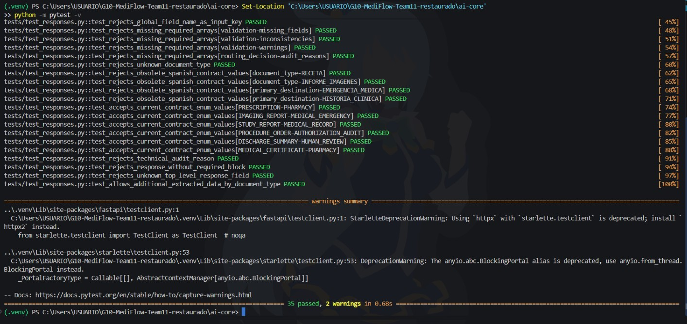
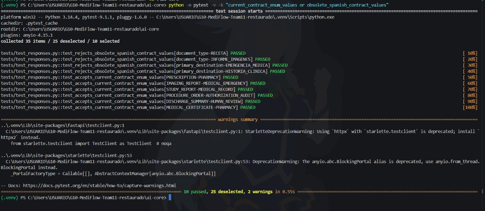
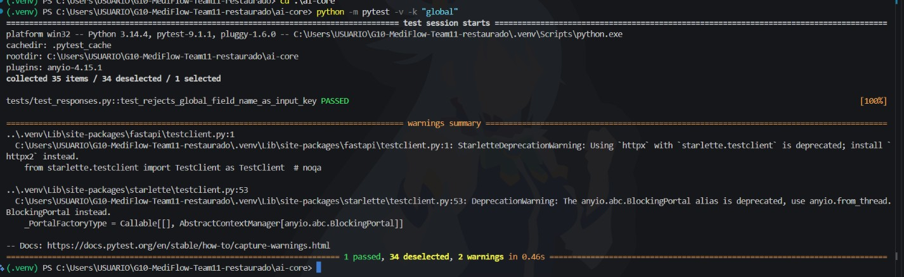
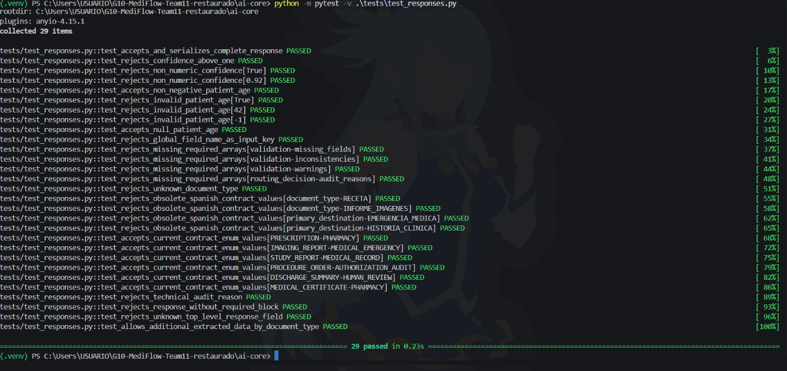

# Evidencia — Ticket #6: Contratos Pydantic de IA Core

## Objetivo

Implementar y validar los modelos Pydantic de entrada y salida de IA Core.

## Contrato de referencia

- `docs/ARCHITECTURE.md`, secciones 4 y 5.
- Issue #6.

## Validaciones realizadas

- `ProcessingRequest` acepta `FILE` con `content_base64`.
- `ProcessingRequest` acepta `TEXT` con `document_text`.
- Se rechazan `FILE` sin Base64 y `TEXT` sin texto.
- Se validan los enums de documento, prioridad, destino y motivos semánticos.
- Los enums usan los identificadores en inglés definidos por la arquitectura
 vigente; se rechazan valores españoles obsoletos.
- Se rechazan confianza fuera de `0–1`, edades negativas, booleanos y strings
 numericos en `patient.age`, y motivos técnicos de Backend.
- `patient.age` acepta `null` y enteros no negativos estrictos.
- `validation.missing_fields`, `inconsistencies` y `warnings` son arrays
 obligatorios, igual que `routing_decision.audit_reasons`.
- La clave de entrada `global` se acepta y `global_` se rechaza.
- La respuesta se serializa con la clave contractual `"global"`.
- `extracted_data` admite campos adicionales por tipo de documento, incluido
 `study_result`.

## Comandos ejecutados

Desde `ai-core/`:

```powershell
python -m pytest -v
python -m pytest -v -k "current_contract_enum_values or obsolete_spanish_contract_values"
python -m pytest -v -k "global"
python -m pytest -v .\tests\test_responses.py

## Resultados de pruebas

- `python -m pytest -q`: `35 passed in 0.68s`.
- Se verificó el rechazo de campos extra en el request y en la respuesta principal.
- Se confirmó que `status` no pertenece al contrato de IA Core.
- Se confirmó que `extracted_data` admite campos adicionales por tipo de documento.
- La serialización JSON conserva `"global" como clave contractual.

## Evidencia de pruebas

- Suite completa: `python -m pytest -v` — **35 passed, 2 warnings in 0.68s**.

  

- Contrato de enums: `python -m pytest -v -k "current_contract_enum_values or obsolete_spanish_contract_values"` — **10 passed, 25 deselected**.

  

- Confianza: `python -m pytest -v -k "global"` — **1 passed, 34 deselected**.

  

- Modelos de respuesta: `python -m pytest -v .\tests\test_responses.py` — **29 passed in 0.23s**.

  

  Resultado final
Los contratos Pydantic de IA Core cumplen el contrato Backend → IA definido en docs/ARCHITECTURE.md.
```
