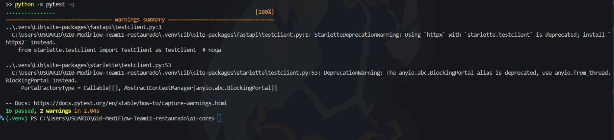
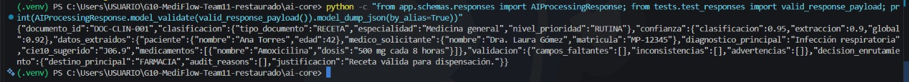

# Evidencia — Ticket #6: Contratos Pydantic de IA Core

## Objetivo

Implementar y validar los modelos Pydantic de entrada y salida de IA Core.

## Contrato de referencia

- `docs/ARCHITECTURE.md`, secciones 4 y 5.
- Issue #6.

## Validaciones realizadas

- `ProcessingRequest` acepta `FILE` con `content_base64`.
- `ProcessingRequest` acepta `TEXT` con `documento_texto`.
- Se rechazan `FILE` sin Base64 y `TEXT` sin texto.
- Se validan los enums de documento, prioridad, destino y motivos semánticos.
- Se rechazan confianza fuera de `0–1`, edad negativa y motivos técnicos de Backend.
- Se rechazan valores booleanos y strings en los tres campos de confianza.
- La respuesta se serializa con la clave contractual `"global"`.

## Comandos ejecutados

```powershell
python -m pip install -r requirements.txt
python -m py_compile .\app\schemas\enums.py
python -m py_compile .\app\schemas\requests.py
python -m py_compile .\app\schemas\responses.py
python -m pytest -q
```

## Resultados de pruebas

- `python -m pytest -q`: `16 passed`.
- Se verificó el rechazo de campos extra en el request y en la respuesta principal.
- Se confirmó que `status` no pertenece al contrato de IA Core.
- Se confirmó que `datos_extraidos` admite campos adicionales por tipo de documento.
- La serialización JSON conserva `"global"` como clave contractual.

## Evidencia visual

### Pruebas automatizadas



### Serialización del contrato



## Resultado final

Los contratos Pydantic de IA Core cumplen el contrato Backend → IA definido en `docs/ARCHITECTURE.md`.
